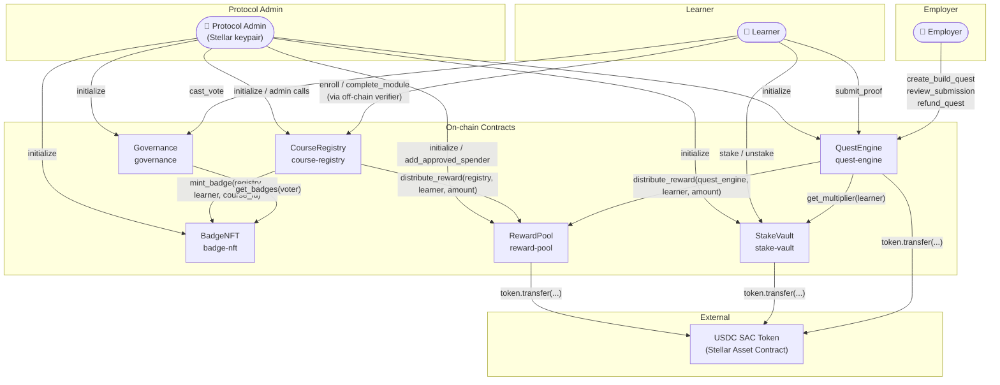
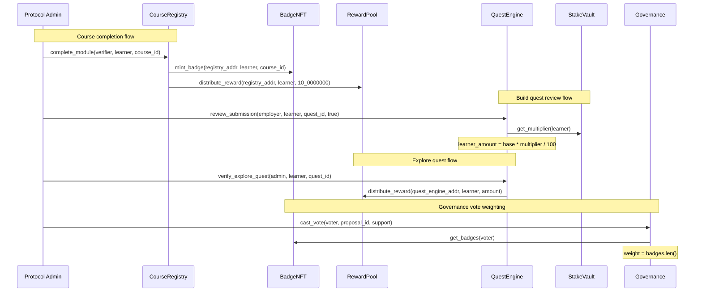

# Orivex Contracts — Architecture Reference

> **Mermaid version:** `10.x` (rendered by GitHub's built-in Mermaid renderer)
>
> **soroban-sdk version:** `23` (see [`Cargo.toml`](./Cargo.toml))

---

## Table of Contents

1. [System Overview](#1-system-overview)
2. [Contract Roles at a Glance](#2-contract-roles-at-a-glance)
3. [Cross-Contract Call Graph](#3-cross-contract-call-graph)
4. [Trust Boundaries](#4-trust-boundaries)
5. [Per-Contract Deep-Dive](#5-per-contract-deep-dive)
   - 5.1 [CourseRegistry](#51-courseregistry)
   - 5.2 [BadgeNFT](#52-badgenft)
   - 5.3 [RewardPool](#53-rewardpool)
   - 5.4 [StakeVault](#54-stakevault)
   - 5.5 [Governance](#55-governance)
   - 5.6 [QuestEngine](#56-questengine)
6. [Wiring Guide](#6-wiring-guide)
7. [Panic Catalog](#7-panic-catalog)
8. [Extension Guide](#8-extension-guide)

---

## 1. System Overview

Orivex is a Soroban-based (Stellar) learn-and-earn protocol. Six contracts collaborate to deliver course management, soulbound credentialing, USDC rewards, staking, governance, and B2B/off-chain bounties.



---

## 2. Contract Roles at a Glance

| Crate | Address alias | Primary responsibility |
| --- | --- | --- |
| `course-registry` | `REGISTRY` | Course CRUD, learner progress, completion fanout (badge mint + reward payout) |
| `badge-nft` | `BADGE` | Soulbound badge issuance, revocation, and lookup |
| `reward-pool` | `POOL` | USDC custody, approved-spender gate, emergency sweep |
| `stake-vault` | `VAULT` | Token lock, unlock, multiplier computation |
| `governance` | `GOV` | Badge-weighted proposal lifecycle |
| `quest-engine` | `QUEST` | Build (employer-funded) and Explore (admin-verified) bounties |

---

## 3. Cross-Contract Call Graph

The arrows below show **every** cross-contract invocation in the current codebase, with the calling function and file location.



### Call table

| Caller contract | Function | Callee contract | Callee function | Source file |
| --- | --- | --- | --- | --- |
| `course-registry` | `complete_module` | `badge-nft` | `mint_badge` | [`contracts/course-registry/src/lib.rs:334`](contracts/course-registry/src/lib.rs#L334) |
| `course-registry` | `complete_module` | `reward-pool` | `distribute_reward` | [`contracts/course-registry/src/lib.rs:345`](contracts/course-registry/src/lib.rs#L345) |
| `quest-engine` | `review_submission` | `stake-vault` | `get_multiplier` | [`contracts/quest-engine/src/lib.rs:311`](contracts/quest-engine/src/lib.rs#L311) |
| `quest-engine` | `verify_explore_quest` | `reward-pool` | `distribute_reward` | [`contracts/quest-engine/src/lib.rs:444`](contracts/quest-engine/src/lib.rs#L444) |
| `governance` | `cast_vote` | `badge-nft` | `get_badges` | [`contracts/governance/src/lib.rs:80`](contracts/governance/src/lib.rs#L80) |

---

## 4. Trust Boundaries

### 4.1 Principal hierarchy

```text
Protocol Admin (keypair)
├── CourseRegistry  ← admin is set at initialize()
│   ├── Trusts BadgeNFT  (address registered via set_badge_nft_address)
│   └── Trusts RewardPool (address registered via set_reward_pool_address)
├── BadgeNFT        ← admin slot = CourseRegistry contract address
├── RewardPool      ← admin slot = Protocol Admin keypair
│   └── Approved spenders: CourseRegistry, QuestEngine (must be added explicitly)
├── StakeVault      ← admin slot = Protocol Admin keypair
├── Governance      ← admin slot = Protocol Admin keypair
│   └── Trusts BadgeNFT (address set at initialize)
└── QuestEngine     ← admin slot = Protocol Admin keypair
    ├── Trusts StakeVault (address set at initialize)
    └── Trusts RewardPool (address set at initialize)
```

### 4.2 Trust assumptions and invariants

| # | Invariant | Where enforced |
| --- | --- | --- |
| T-1 | Only the Protocol Admin can register satellite contract addresses on `CourseRegistry` | `set_badge_nft_address`, `set_reward_pool_address` — assert `caller == stored_admin` |
| T-2 | `BadgeNFT` only accepts mint/revoke from its stored `Admin` (which must be the `CourseRegistry` address) | `mint_badge` / `revoke_badge` — `caller == stored_admin` assert |
| T-3 | `RewardPool` only pays out to callers in its approved-spender set | `distribute_reward` — persistent `DataKey::Spender(caller)` must be `true` |
| T-4 | `Governance` vote weight is read live from `BadgeNFT` at call time — badge holdings at vote-cast time determine weight | `cast_vote` cross-call |
| T-5 | `StakeVault` multiplier is read live at review time; the multiplier is capped so it cannot exceed the available locked funds | `review_submission` — `calculated_boost` capped to `base_learner_amount` |
| T-6 | `QuestEngine` must be an approved spender on `RewardPool` before Explore quest payouts will succeed | `add_approved_spender` (admin) |
| T-7 | Re-initialization is always blocked by an `instance().has(&DataKey::Admin)` guard | All six contracts' `initialize` functions |

### 4.3 What each contract does NOT trust

- **CourseRegistry** does not trust the learner to self-report completion — only the Protocol Admin (acting as verifier) can call `complete_module`.
- **BadgeNFT** does not trust an arbitrary caller — even the Protocol Admin keypair cannot mint directly; the registered registry address must be the caller.
- **RewardPool** does not trust any contract that has not been explicitly whitelisted via `add_approved_spender`.
- **Governance** does not validate proposal content on-chain — it relies on off-chain meta-governance for meaning. Execution marks a proposal `executed = true` but performs no on-chain action beyond that.

### 4.4 Recovery flows

| Scenario | Recovery path |
| --- | --- |
| RewardPool over-funded or exploit detected | `emergency_sweep(admin, recovery_wallet)` — transfers full balance |
| RewardPool needs to pause disbursements | `set_pause(admin, true)` — blocks all `distribute_reward` calls |
| QuestEngine needs to pause payouts | `set_pause(admin, true)` — blocks `review_submission` and `batch_review_submissions` |
| Fraudulent badge issued | `revoke_badge(admin, learner, course_id)` on `BadgeNFT` |
| Contract logic bug discovered | `upgrade_contract(admin, new_wasm_hash)` available on all six contracts |
| Rogue instructor | `transfer_ownership(current_instructor, new_instructor, course_id)` on `CourseRegistry` |

---

## 5. Per-Contract Deep-Dive

---

### 5.1 CourseRegistry

**Crate:** `contracts/course-registry`
**Source:** [`contracts/course-registry/src/lib.rs`](contracts/course-registry/src/lib.rs) · [`types.rs`](contracts/course-registry/src/types.rs)

#### Storage layout

| Key | Storage tier | Type | Description |
| --- | --- | --- | --- |
| `DataKey::Admin` | Instance | `Address` | Protocol Admin set at `initialize` |
| `DataKey::CourseCount` | Instance | `u32` | Monotonically increasing course ID counter |
| `DataKey::BadgeNftAddress` | Instance | `Address` | Wired BadgeNFT contract address |
| `DataKey::RewardPoolAddress` | Instance | `Address` | Wired RewardPool contract address |
| `DataKey::Course(id)` | Persistent | `Course` | Full course struct indexed by `u32` ID |
| `DataKey::Progress(learner, id)` | Persistent | `u32` | Modules completed by learner for a course |

`Course` struct ([`types.rs:4`](contracts/course-registry/src/types.rs#L4)):

```rust
pub struct Course {
    pub instructor: Address,
    pub total_modules: u32,
    pub metadata_hash: BytesN<32>,  // IPFS CID
    pub active: bool,
}
```

#### Auth model

| Function | Who may call |
| --- | --- |
| `initialize` | Anyone (once only — idempotent guard) |
| `set_reward_pool_address` | Protocol Admin |
| `set_badge_nft_address` | Protocol Admin |
| `create_course` | Protocol Admin |
| `update_metadata` | Course instructor (`course.instructor.require_auth()`) |
| `enroll` | Learner themselves |
| `set_course_status` | Protocol Admin |
| `transfer_ownership` | Current course instructor |
| `complete_module` | Protocol Admin (acting as verifier) |
| `upgrade_contract` | Protocol Admin |
| `get_course`, `get_progress`, `course_count`, `is_course_finished` | Anyone (read-only) |

#### Events emitted

| Event | Trigger |
| --- | --- |
| `CourseCreated { id, instructor, total_modules }` | `create_course` |
| `MetadataUpdated { id, instructor, new_hash }` | `update_metadata` |
| `CourseStatusChanged { id, active }` | `set_course_status` |
| `OwnershipTransferred { course_id, previous_instructor, new_instructor }` | `transfer_ownership` |
| `ModuleCompleted { learner, course_id, new_progress }` | `complete_module` (every call) |
| `CourseCompleted { learner, course_id, reward_amount }` | `complete_module` (final module only, when RewardPool is wired) |
| `ContractUpgraded { admin, new_wasm_hash }` | `upgrade_contract` |

#### Key constants

| Constant | Value | Meaning |
| --- | --- | --- |
| `INITIAL_COURSE_ID` | `1` | First course ID (counter starts at 0, increments before use) |
| `BASE_REWARD_AMOUNT` | `10_0000000` (10 USDC) | Fixed USDC payout on course completion |
| `DEFAULT_TOTAL_MODULES_BOUND` | `1000` | Informational cap; not enforced on-chain |

---

### 5.2 BadgeNFT

**Crate:** `contracts/badge-nft`
**Source:** [`contracts/badge-nft/src/lib.rs`](contracts/badge-nft/src/lib.rs) · [`types.rs`](contracts/badge-nft/src/types.rs)

#### Compile-time feature flag

The contract struct is gated behind the `contract` feature (`#[cfg(feature = "contract")]`). When `badge-nft` is used as a dependency, dependents set `default-features = false` to import only `BadgeNFTClient` (generated by `#[contractclient]`) and avoid duplicate symbol errors at link time.

#### Storage layout

| Key | Storage tier | Type | Description |
| --- | --- | --- | --- |
| `DataKey::Admin` | Instance | `Address` | Authorized minter — must equal `CourseRegistry` address |
| `DataKey::UserBadges(learner)` | Persistent | `Vec<Badge>` | All soulbound badges for a learner |

`Badge` struct ([`types.rs:4`](contracts/badge-nft/src/types.rs#L4)):

```rust
pub struct Badge {
    pub course_id: u32,
    pub minted_at: u64,  // ledger timestamp
}
```

#### Auth model

| Function | Who may call |
| --- | --- |
| `initialize` | Anyone (once only) |
| `mint_badge` | Stored Admin (== CourseRegistry address) |
| `revoke_badge` | Stored Admin (== CourseRegistry address) |
| `upgrade_contract` | Stored Admin |
| `get_badges`, `get_badge_count`, `has_badge` | Anyone (read-only) |

#### Soulbound invariants

- One badge per `(learner, course_id)` pair — duplicate mint panics with `"Badge for this course already exists"`.
- Revocation removes the badge from the `Vec<Badge>` permanently; there is no on-chain archive.
- `MAX_BADGES_PER_LEARNER = 64` bounds linear-scan gas cost for `has_badge`, `get_badges`, and the duplicate check in `mint_badge`.

#### Events emitted

| Event | Trigger |
| --- | --- |
| `BadgeMinted { learner, course_id, minted_at }` | `mint_badge` |
| `BadgeRevoked { learner, course_id }` | `revoke_badge` (only when badge was present) |
| `ContractUpgraded { admin, new_wasm_hash }` | `upgrade_contract` |

---

### 5.3 RewardPool

**Crate:** `contracts/reward-pool`
**Source:** [`contracts/reward-pool/src/lib.rs`](contracts/reward-pool/src/lib.rs) · [`types.rs`](contracts/reward-pool/src/types.rs)

#### Compile-time feature flag

Same pattern as `badge-nft`: contract implementation gated by `#[cfg(feature = "contract")]`; `RewardPoolClient` is always generated via `#[contractclient]`.

#### Storage layout

| Key | Storage tier | Type | Description |
| --- | --- | --- | --- |
| `DataKey::Admin` | Instance | `Address` | Protocol Admin |
| `DataKey::Token` | Instance | `Address` | USDC SAC token address |
| `DataKey::IsPaused` | Instance | `bool` | Circuit breaker flag (default `false`) |
| `DataKey::Spender(address)` | Persistent | `bool` | Approved spender entry (true = whitelisted) |

#### Auth model

| Function | Who may call |
| --- | --- |
| `initialize` | Anyone (once only, requires admin auth) |
| `add_approved_spender` | Protocol Admin |
| `set_pause` | Protocol Admin |
| `distribute_reward` | Any approved spender (whitelisted via `add_approved_spender`) |
| `fund_pool` | Anyone (any donor) |
| `emergency_sweep` | Protocol Admin |
| `upgrade_contract` | Protocol Admin |

#### Fee structure

| Constant | Value | Meaning |
| --- | --- | --- |
| `PLATFORM_FEE_BASIS_POINTS` | `1500` | 15% platform fee (informational — applied by callers, not by this contract) |
| `MIN_PAYOUT_AMOUNT` | `1` | Floor for `distribute_reward` amount |
| `REWARD_TOKEN_DECIMALS` | `7` | USDC decimal precision on Stellar |

#### Events emitted

| Event | Trigger |
| --- | --- |
| `PoolInitialized { admin, token }` | `initialize` |
| `SpenderAdded { spender }` | `add_approved_spender` |
| `PoolFunded { donor, amount }` | `fund_pool` |
| `RewardDistributed { caller, learner, amount }` | `distribute_reward` |
| `EmergencySweep { admin, recovery_wallet, amount }` | `emergency_sweep` |
| `ContractUpgraded { admin, new_wasm_hash }` | `upgrade_contract` |

---

### 5.4 StakeVault

**Crate:** `contracts/stake-vault`
**Source:** [`contracts/stake-vault/src/lib.rs`](contracts/stake-vault/src/lib.rs) · [`types.rs`](contracts/stake-vault/src/types.rs)

#### Storage layout

| Key | Storage tier | Type | Description |
| --- | --- | --- | --- |
| `DataKey::Admin` | Instance | `Address` | Protocol Admin |
| `DataKey::Token` | Instance | `Address` | Staking token address |
| `DataKey::UserStake(user)` | Persistent | `StakeInfo` | Per-user staked amount and lock timestamp |

`StakeInfo` struct ([`types.rs:4`](contracts/stake-vault/src/types.rs#L4)):

```rust
pub struct StakeInfo {
    pub amount: i128,
    pub lock_timestamp: u64,  // reset on every stake() call
}
```

#### Auth model

| Function | Who may call |
| --- | --- |
| `initialize` | Anyone (once only, requires admin auth) |
| `stake` | The user staking (self-auth) |
| `unstake` | The user unstaking (self-auth) |
| `get_multiplier` | Anyone (read-only, used by QuestEngine) |
| `upgrade_contract` | Protocol Admin |

#### Multiplier tiers

| Staked amount | BPS | Effective multiplier |
| --- | --- | --- |
| `< 100` | `100` | 1.0× |
| `≥ 100` and `< 500` | `120` | 1.2× |
| `≥ 500` | `200` | 2.0× |

Source: [`lib.rs`](contracts/stake-vault/src/lib.rs) `get_multiplier` function.

The multiplier is applied as `(base_learner_amount * multiplier) / 100` in `QuestEngine::review_submission`, but the result is capped to `base_learner_amount` because the employer-funded quest pool does not hold extra funds for the boost.

#### Lock period

`DEFAULT_LOCK_PERIOD_SECONDS = 604800` (7 days). Each call to `stake` resets `lock_timestamp` to the current ledger time, restarting the lock. `unstake` panics with `"Lock period active"` if called before expiry.

#### Events emitted

| Event | Trigger |
| --- | --- |
| `StakeVaultInitialized { admin, token }` | `initialize` |
| `Staked { user, amount, total_staked, lock_timestamp }` | `stake` |
| `Unstaked { user, amount }` | `unstake` |
| `ContractUpgraded { admin, new_wasm_hash }` | `upgrade_contract` |

---

### 5.5 Governance

**Crate:** `contracts/governance`
**Source:** [`contracts/governance/src/lib.rs`](contracts/governance/src/lib.rs) · [`types.rs`](contracts/governance/src/types.rs)

#### Storage layout

| Key | Storage tier | Type | Description |
| --- | --- | --- | --- |
| `DataKey::Admin` | Instance | `Address` | Protocol Admin |
| `"badge"` (Symbol) | Instance | `Address` | BadgeNFT contract address for vote weight |
| `DataKey::Proposal(id)` | Persistent | `Proposal` | Full proposal struct |
| `DataKey::UserVote(voter, proposal_id)` | Persistent | `bool` | Double-vote guard |

`Proposal` struct ([`types.rs:4`](contracts/governance/src/types.rs#L4)):

```rust
pub struct Proposal {
    pub id: u32,
    pub proposer: Address,
    pub metadata_hash: BytesN<32>,  // IPFS CID for proposal text
    pub votes_for: u32,
    pub votes_against: u32,
    pub end_time: u64,              // Unix timestamp
    pub executed: bool,             // also used as "cancelled" flag
}
```

#### Auth model

| Function | Who may call |
| --- | --- |
| `initialize` | Anyone (once only, requires admin auth) |
| `cast_vote` | Any address (weight = badge count at call time) |
| `cancel_proposal` | Proposer OR Protocol Admin (before `end_time`) |
| `execute_proposal` | Anyone (after `end_time`, if `votes_for > votes_against`) |
| `upgrade_contract` | Protocol Admin |
| `get_proposal` | Anyone (read-only) |

#### Proposal lifecycle

```text
[created] → [voting period: end_time not reached]
                ├── cancel_proposal()  → executed = true  (CANCELLED)
                └── [end_time reached]
                        ├── votes_for > votes_against → execute_proposal() → executed = true  (EXECUTED)
                        └── votes_for ≤ votes_against → execute_proposal() panics "Proposal rejected"
```

Note: cancellation reuses `executed = true` as the locked state. Inspect the ledger timestamp vs `end_time` to distinguish cancelled from executed.

#### Key constants

| Constant | Value |
| --- | --- |
| `QUORUM_BASIS_POINTS` | `3300` (33%) — informational, not currently enforced on-chain |
| `DEFAULT_VOTING_PERIOD_SECONDS` | `604800` (7 days) |

#### Events emitted

| Event | Trigger |
| --- | --- |
| `ProposalExecuted { proposal_id, proposer }` | `execute_proposal` |
| `ProposalCancelled { proposal_id, cancelled_by }` | `cancel_proposal` |
| `ContractUpgraded { admin, new_wasm_hash }` | `upgrade_contract` |

---

### 5.6 QuestEngine

**Crate:** `contracts/quest-engine`
**Source:** [`contracts/quest-engine/src/lib.rs`](contracts/quest-engine/src/lib.rs) · [`types.rs`](contracts/quest-engine/src/types.rs)

#### Storage layout

| Key | Storage tier | Type | Description |
| --- | --- | --- | --- |
| `DataKey::Admin` | Instance | `Address` | Protocol Admin |
| `DataKey::Token` | Instance | `Address` | USDC SAC token address |
| `DataKey::QuestCounter` | Instance | `u32` | Monotonically increasing quest ID |
| `DataKey::RewardPool` | Instance | `Address` | RewardPool contract address |
| `DataKey::StakeVault` | Instance | `Address` | StakeVault contract address |
| `DataKey::IsPaused` | Instance | `bool` | Circuit breaker (default `false`) |
| `DataKey::Quest(id)` | Persistent | `Quest` | Quest struct |
| `DataKey::Submission(learner, quest_id)` | Persistent | `Submission` | Per-(learner, quest) submission |

`Quest` struct ([`types.rs:16`](contracts/quest-engine/src/types.rs#L16)):

```rust
pub struct Quest {
    pub employer: Address,
    pub reward_amount: i128,
    pub quest_type: QuestType,   // Build | Explore
    pub metadata_hash: BytesN<32>,
    pub active: bool,
}
```

`Submission` struct ([`types.rs:30`](contracts/quest-engine/src/types.rs#L30)):

```rust
pub struct Submission {
    pub proof_hash: BytesN<32>,
    pub status: SubmissionStatus,  // Pending | Approved | Rejected
}
```

#### Auth model

| Function | Who may call |
| --- | --- |
| `initialize` | Anyone (once only, requires admin auth) |
| `set_pause` | Protocol Admin |
| `create_build_quest` | Any employer (self-funded) |
| `create_explore_quest` | Protocol Admin |
| `submit_proof` | Any learner (Build quests only) |
| `review_submission` | Quest employer |
| `batch_review_submissions` | Quest employer |
| `refund_quest` | Quest employer |
| `verify_explore_quest` | Protocol Admin |
| `upgrade_contract` | Protocol Admin |
| `get_quest`, `get_submission` | Anyone (read-only) |

#### Build quest payout flow

```text
employer funds quest (reward_amount locked in QuestEngine)
    ↓
learner submits proof → Pending
    ↓
employer reviews:
    approve → fee = reward_amount * 15 / 100
              learner_amount = reward_amount - fee
              multiplier = StakeVault.get_multiplier(learner)   [cross-call]
              boosted = learner_amount * multiplier / 100
              actual_learner_payout = min(boosted, learner_amount)  ← capped
              transfer(quest_engine → reward_pool_addr, fee)
              transfer(quest_engine → learner, actual_learner_payout)
    reject  → status = Rejected (no transfer)
```

#### Explore quest payout flow

```text
admin creates explore quest (reward_amount stored, no funds locked)
    ↓
admin verifies off-chain action → verify_explore_quest(admin, learner, quest_id)
    ↓
QuestEngine calls RewardPool.distribute_reward(quest_engine_addr, learner, amount)
    ↓
RewardPool transfers USDC from its own balance to learner
```

**Prerequisite:** `QuestEngine` must be an approved spender on `RewardPool`.

#### Events emitted

| Event | Trigger |
| --- | --- |
| `QuestCreated { employer, quest_id, reward_amount }` | `create_build_quest`, `create_explore_quest` |
| `ProofSubmitted { learner, quest_id, proof_hash }` | `submit_proof` |
| `SubmissionReviewed { employer, learner, quest_id, approved }` | `review_submission`, `batch_review_submissions` (per learner) |
| `BatchReviewed { employer, quest_id, approved_count }` | `batch_review_submissions` (summary) |
| `QuestRefunded { employer, quest_id, amount }` | `refund_quest` |
| `ExploreQuestVerified { admin, learner, quest_id, amount }` | `verify_explore_quest` |
| `ContractUpgraded { admin, new_wasm_hash }` | `upgrade_contract` |

---

## 6. Wiring Guide

This section lists every admin call required to bring all six contracts from freshly-deployed to fully-operational, in dependency order.

### Step 1 — Deploy all contracts

Deploy each WASM independently. Each contract receives its own unique address on the Stellar network.

```bash
stellar contract deploy --wasm target/wasm32-unknown-unknown/release/badge_nft.wasm
# → $BADGE_ADDR

stellar contract deploy --wasm target/wasm32-unknown-unknown/release/reward_pool.wasm
# → $POOL_ADDR

stellar contract deploy --wasm target/wasm32-unknown-unknown/release/stake_vault.wasm
# → $VAULT_ADDR

stellar contract deploy --wasm target/wasm32-unknown-unknown/release/course_registry.wasm
# → $REGISTRY_ADDR

stellar contract deploy --wasm target/wasm32-unknown-unknown/release/governance.wasm
# → $GOV_ADDR

stellar contract deploy --wasm target/wasm32-unknown-unknown/release/quest_engine.wasm
# → $QUEST_ADDR
```

### Step 2 — Initialize contracts (order matters)

Initialize leaf contracts first so their addresses are known before being registered in dependents.

```bash
# 2a. BadgeNFT — admin = CourseRegistry address (not the keypair)
stellar contract invoke --id $BADGE_ADDR -- initialize \
  --admin $REGISTRY_ADDR

# 2b. RewardPool — admin = Protocol Admin keypair
stellar contract invoke --id $POOL_ADDR -- initialize \
  --admin $ADMIN_ADDR --token $USDC_SAC_ADDR

# 2c. StakeVault — admin = Protocol Admin keypair
stellar contract invoke --id $VAULT_ADDR -- initialize \
  --admin $ADMIN_ADDR --token $USDC_SAC_ADDR

# 2d. CourseRegistry — admin = Protocol Admin keypair
stellar contract invoke --id $REGISTRY_ADDR -- initialize \
  --admin $ADMIN_ADDR

# 2e. Governance — admin = Protocol Admin keypair, badge = BadgeNFT address
stellar contract invoke --id $GOV_ADDR -- initialize \
  --admin $ADMIN_ADDR --badge_contract_address $BADGE_ADDR

# 2f. QuestEngine — wires RewardPool and StakeVault at init time
stellar contract invoke --id $QUEST_ADDR -- initialize \
  --admin $ADMIN_ADDR --token $USDC_SAC_ADDR \
  --reward_pool $POOL_ADDR --stake_vault $VAULT_ADDR
```

### Step 3 — Wire CourseRegistry to its satellites

```bash
stellar contract invoke --id $REGISTRY_ADDR -- set_badge_nft_address \
  --admin $ADMIN_ADDR --badge_nft_address $BADGE_ADDR

stellar contract invoke --id $REGISTRY_ADDR -- set_reward_pool_address \
  --admin $ADMIN_ADDR --reward_pool_address $POOL_ADDR
```

### Step 4 — Register approved spenders on RewardPool

```bash
# CourseRegistry may trigger distribute_reward on course completion
stellar contract invoke --id $POOL_ADDR -- add_approved_spender \
  --admin $ADMIN_ADDR --spender $REGISTRY_ADDR

# QuestEngine may trigger distribute_reward for Explore quests
stellar contract invoke --id $POOL_ADDR -- add_approved_spender \
  --admin $ADMIN_ADDR --spender $QUEST_ADDR
```

### Step 5 — Fund the RewardPool

```bash
stellar contract invoke --id $POOL_ADDR -- fund_pool \
  --donor $DONOR_ADDR --amount 1000_0000000
  # ^ 1,000 USDC (7 decimal places)
```

### Wiring dependency diagram

```mermaid
flowchart LR
    D1["Deploy all 6 contracts"] --> I1
    I1["initialize BadgeNFT\n(admin = REGISTRY_ADDR)"] --> I2
    I2["initialize RewardPool\n(admin = ADMIN_ADDR)"] --> I3
    I3["initialize StakeVault\n(admin = ADMIN_ADDR)"] --> I4
    I4["initialize CourseRegistry\n(admin = ADMIN_ADDR)"] --> I5
    I5["initialize Governance\n(admin = ADMIN_ADDR)"] --> I6
    I6["initialize QuestEngine\n(admin = ADMIN_ADDR)"] --> W1
    W1["set_badge_nft_address\non CourseRegistry"] --> W2
    W2["set_reward_pool_address\non CourseRegistry"] --> W3
    W3["add_approved_spender\n(REGISTRY_ADDR) on RewardPool"] --> W4
    W4["add_approved_spender\n(QUEST_ADDR) on RewardPool"] --> W5
    W5["fund_pool\n(initial USDC deposit)"]
```



### Verification checklist

After wiring, verify end-to-end with a test call sequence:

- [ ] `CourseRegistry::create_course` succeeds
- [ ] `CourseRegistry::enroll(learner, course_id)` succeeds
- [ ] `CourseRegistry::complete_module` (all modules) emits `CourseCompleted` and `BadgeMinted` and `RewardDistributed`
- [ ] `BadgeNFT::has_badge(learner, course_id)` returns `true`
- [ ] `Governance::cast_vote` with a badge-holding voter returns incremented `votes_for`
- [ ] `QuestEngine::create_build_quest` succeeds and locks employer funds
- [ ] `QuestEngine::verify_explore_quest` succeeds and emits `RewardDistributed`

---

## 7. Panic Catalog

All panics produced by the current codebase, grouped by contract. The "Condition" column describes the on-chain state that causes the panic; "Source" links to the relevant file.

### CourseRegistry

| Panic message | Condition | Source |
| --- | --- | --- |
| `"Already initialized"` | `DataKey::Admin` already in instance storage | [`lib.rs`](contracts/course-registry/src/lib.rs) `initialize` |
| `"Contract not initialized"` | `DataKey::Admin` absent when an admin-only fn is called | multiple functions |
| `"Unauthorized: Caller is not the protocol admin"` | `caller != stored_admin` in any admin-gated function | multiple functions |
| `"total_modules must be greater than 0"` | `total_modules == 0` in `create_course` | `create_course` |
| `"Course not found"` | `DataKey::Course(id)` absent in persistent storage | `get_course`, `update_metadata`, `set_course_status`, `complete_module`, etc. |
| `"Course is not active"` | `course.active == false` on `enroll` | `enroll` |
| `"Learner already enrolled"` | `DataKey::Progress(learner, id)` already exists | `enroll` |
| `"Unauthorized: Caller is not the course instructor"` | `course.instructor != current_instructor` in `transfer_ownership` | `transfer_ownership` |
| `"Course already completed"` | `current_progress >= course.total_modules` in `complete_module` | `complete_module` |
| `"Unauthorized"` | `admin != stored_admin` in `upgrade_contract` | `upgrade_contract` |
| `"Not initialized"` | `DataKey::Admin` absent in `upgrade_contract` | `upgrade_contract` |

### BadgeNFT

| Panic message | Condition | Source |
| --- | --- | --- |
| `"Already initialized"` | `DataKey::Admin` already present | `initialize` |
| `"Contract not initialized"` | `DataKey::Admin` absent when mint/revoke is called | `mint_badge`, `revoke_badge` |
| `"Unauthorized: Caller is not the authorized registry"` | `caller != stored_admin` in `mint_badge` / `revoke_badge` | `mint_badge`, `revoke_badge` |
| `"Badge for this course already exists"` | Duplicate `(learner, course_id)` in `mint_badge` | `mint_badge` |
| `"Unauthorized"` | Non-admin calls `upgrade_contract` | `upgrade_contract` |
| `"Not initialized"` | Admin absent in `upgrade_contract` | `upgrade_contract` |

### RewardPool

| Panic message | Condition | Source |
| --- | --- | --- |
| `"Already initialized"` | `DataKey::Admin` already present | `initialize` |
| `"Unauthorized"` | `admin != stored_admin` in admin-gated functions | `add_approved_spender`, `set_pause`, `emergency_sweep`, `upgrade_contract` |
| `"Not initialized"` | Admin or token absent when required | multiple functions |
| `"Contract is paused"` | `DataKey::IsPaused == true` on `distribute_reward` | `distribute_reward` |
| `"Amount must be positive"` | `amount <= 0` in `distribute_reward` | `distribute_reward` |
| `"Caller is not an authorized spender"` | `DataKey::Spender(caller)` not `true` | `distribute_reward` |

### StakeVault

| Panic message | Condition | Source |
| --- | --- | --- |
| `"Already initialized"` | `DataKey::Admin` already present | `initialize` |
| `"Amount must be positive"` | `amount <= 0` in `stake` | `stake` |
| `"Not initialized"` | Token absent when `stake` is called | `stake` |
| `"No stake found"` | `DataKey::UserStake(user)` absent on `unstake` | `unstake` |
| `"Lock period active"` | `now < lock_timestamp + 604800` on `unstake` | `unstake` |
| `"Unauthorized"` | Non-admin calls `upgrade_contract` | `upgrade_contract` |
| `"Not initialized"` | Admin absent in `upgrade_contract` | `upgrade_contract` |

### Governance

| Panic message | Condition | Source |
| --- | --- | --- |
| `"Already initialized"` | `"badge"` symbol key already present | `initialize` |
| `"Contract not initialized"` | Badge address absent when voting | `cast_vote` |
| `"Already voted"` | `DataKey::UserVote(voter, proposal_id)` exists | `cast_vote` |
| `"Vote overflow"` | `votes_for` or `votes_against` overflows `u32` | `cast_vote` |
| `"Proposal not found"` | `DataKey::Proposal(id)` absent | `get_proposal` (called by many) |
| `"Not initialized"` | Admin absent | `cancel_proposal`, `upgrade_contract` |
| `"Unauthorized"` | Caller is not proposer or admin in `cancel_proposal`; or non-admin in `upgrade_contract` | `cancel_proposal`, `upgrade_contract` |
| `"Voting ended"` | `now >= proposal.end_time` in `cancel_proposal` | `cancel_proposal` |
| `"Already executed"` | `proposal.executed == true` in `cancel_proposal` / `execute_proposal` | `cancel_proposal`, `execute_proposal` |
| `"Voting still active"` | `now <= proposal.end_time` in `execute_proposal` | `execute_proposal` |
| `"Proposal rejected"` | `votes_for <= votes_against` in `execute_proposal` | `execute_proposal` |

### QuestEngine

| Panic message | Condition | Source |
| --- | --- | --- |
| `"Already initialized"` | `DataKey::Token` already present | `initialize` |
| `"Not initialized"` | Admin, token, stake vault, or reward pool absent | multiple functions |
| `"Unauthorized"` | `admin != stored_admin` | `create_explore_quest`, `set_pause`, `verify_explore_quest`, `upgrade_contract` |
| `"Contract is paused"` | `DataKey::IsPaused == true` | `review_submission`, `batch_review_submissions` |
| `"Quest not found"` | `DataKey::Quest(id)` absent | `review_submission`, `batch_review_submissions`, `refund_quest`, `verify_explore_quest` |
| `"Quest is not active"` | `quest.active == false` in `submit_proof` | `submit_proof` |
| `"Only Build quests accept submissions"` | `quest.quest_type != QuestType::Build` | `submit_proof` |
| `"Submission already exists"` | `DataKey::Submission(learner, quest_id)` already present | `submit_proof` |
| `"Only the quest employer can review submissions"` | `quest.employer != employer` | `review_submission`, `batch_review_submissions` |
| `"Submission not found"` | `DataKey::Submission` absent | `review_submission`, `batch_review_submissions` |
| `"Submission is not pending review"` | `submission.status != Pending` | `review_submission`, `batch_review_submissions` |
| `"Quest already inactive"` | `quest.active == false` in `refund_quest` | `refund_quest` |
| `"Not an Explore quest"` | `quest.quest_type != QuestType::Explore` | `verify_explore_quest` |

---

## 8. Extension Guide

### 8.1 Adding a new contract

1. **Create the crate** under `contracts/` following the existing workspace layout:

   ```text
   contracts/
   └── my-contract/
       ├── Cargo.toml
       └── src/
           ├── lib.rs
           └── types.rs
   ```

2. **Add to the workspace** in [`contracts/Cargo.toml`](contracts/Cargo.toml):

   ```toml
   [workspace]
   members = [
       # ... existing members ...
       "my-contract",
   ]
   ```

3. **Use the feature-flag pattern** if other contracts need to call yours as a client:

   ```toml
   # my-contract/Cargo.toml
   [features]
   default = ["contract"]
   contract = []

   [dependencies]
   soroban-sdk = { workspace = true }
   ```

   In `lib.rs`:

   ```rust
   #[contractclient(name = "MyClient")]
   pub trait MyInterface { ... }

   #[cfg(feature = "contract")]
   mod contract_impl {
       #[contract]
       pub struct MyContract;
       // ...
   }

   #[cfg(feature = "contract")]
   pub use contract_impl::MyContract;
   ```

4. **Add an `initialize` function** that writes an `Admin` key to instance storage and guards against re-initialization with `if env.storage().instance().has(&DataKey::Admin) { panic!("Already initialized"); }`.

5. **Add `upgrade_contract`** following the pattern in any existing contract (admin-only WASM upgrade + `ContractUpgraded` event).

6. **Register in the wiring sequence** (Section 6) if the new contract needs to be a trusted caller of an existing contract, and add to the approved-spender list on `RewardPool` if it will trigger payouts.

---

### 8.2 Adding a new event

Events in Soroban are defined with `#[contractevent]`. To add a new event:

1. Define the struct adjacent to the existing events in the contract's `lib.rs`:

   ```rust
   #[contractevent]
   pub struct MyEvent {
       #[topic]
       pub relevant_field: Address,  // topics are indexed
       pub data_field: i128,         // data is unindexed
   }
   ```

2. Emit it inside the relevant function:

   ```rust
   MyEvent { relevant_field, data_field }.publish(&env);
   ```

3. Add an entry to the events table in the [Per-Contract Deep-Dive](#5-per-contract-deep-dive) section of this document.

Guidelines:

- Use at most **three** `#[topic]` fields (Soroban host limit).
- Topics should be the fields most commonly filtered on by indexers (addresses, IDs).
- Event names should be past-tense descriptive nouns (`CourseCompleted`, not `CompleteCourse`).

---

### 8.3 Adding a new admin role

The current design uses a single Protocol Admin per contract. To introduce a secondary role (e.g., a `Reviewer` role separate from `Admin`):

1. **Add a new `DataKey` variant** in `types.rs`:

   ```rust
   pub enum DataKey {
       Admin,
       Reviewer,   // ← new
       // ...
   }
   ```

2. **Set the role during initialization or via a dedicated setter** (admin-only):

   ```rust
   pub fn set_reviewer(env: Env, admin: Address, reviewer: Address) {
       admin.require_auth();
       let stored_admin: Address = env.storage().instance()
           .get(&DataKey::Admin).expect("Not initialized");
       assert!(admin == stored_admin, "Unauthorized");
       env.storage().instance().set(&DataKey::Reviewer, &reviewer);
   }
   ```

3. **Guard the new function** with a `caller == stored_reviewer` assertion plus `caller.require_auth()`.

4. **Document the new role** in the Auth model table of the relevant deep-dive section.

---

### 8.4 Adding a new storage key

When adding a new persistent or instance key:

1. Add the variant to `DataKey` in `types.rs` with a descriptive name.
2. Choose the storage tier deliberately:
   - **Instance** — contract-wide config that rarely changes (admin, token address, flags). Counts toward the 64 KiB instance storage budget.
   - **Persistent** — per-user or per-entity records. Each key-value pair has its own TTL/rent; bump TTL in the same transaction as the write for entries that must survive.
   - **Temporary** — use only for ephemeral data that can be reconstructed (not yet used in this codebase).
3. Document the key in the Storage layout table of the relevant deep-dive section.

---

### 8.5 Generating API docs

```bash
cd contracts
cargo doc --no-deps --open
```

This renders inline `///` doc comments for all six contracts in a single local HTML site. All public functions carry doc comments in the current codebase.

---

*Last updated: 2026-07-20. For questions, open an issue or see [`CONTRIBUTING.md`](CONTRIBUTING.md).*
